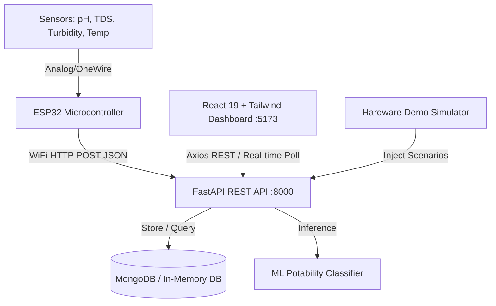

# 🌊 AquaSense IoT — Smart Water Quality & Potability Monitoring System

[](https://opensource.org/licenses/MIT)
[](https://fastapi.tiangolo.com)
[](https://react.dev)
[](https://tailwindcss.com)
[](https://www.espressif.com)
[](https://www.python.org)

**AquaSense** is an end-to-end IoT and Machine Learning system engineered for real-time water quality monitoring, salinity assessment, and autonomous potability classification. Designed for smart agriculture, domestic water supplies, and environmental monitoring, it bridges physical multi-channel electrochemical sensors with a high-performance FastAPI backend and a responsive dark-mode React dashboard.

---

## 📑 Table of Contents
1. [System Architecture](#-system-architecture)
2. [Core Features](#-core-features)
3. [Hardware Bill of Materials (BOM)](#-hardware-bill-of-materials-bom)
4. [Circuit Diagram & ESP32 Pinout](#-circuit-diagram--esp32-pinout)
5. [Sensor Usage & Calibration Guide](#-sensor-usage--calibration-guide)
6. [ESP32 Firmware Flashing Guide](#-esp32-firmware-flashing-guide)
7. [Software Installation & Setup](#-software-installation--setup)
8. [API Reference](#-api-reference)
9. [Viva & Demo Testing Scenarios](#-viva--demo-testing-scenarios)
10. [Project Directory Structure](#-project-directory-structure)

---

## 🏗 System Architecture



---

## ✨ Core Features

* **5-Channel Physicochemical Telemetry**: Continuous real-time measurement of **pH**, **TDS (Total Dissolved Solids)**, **Turbidity (NTU)**, **Water Temperature (°C)**, and **Dissolved Oxygen (DO)**.
* **Autonomous ML Potability Classification**: Evaluates multi-variate water parameters using Random Forest / XGBoost models against **WHO Guidelines (4th Edition)** and **EPA Secondary Standards (40 CFR)**.
* **Interactive ML Playground & Presets**: Simulate water quality using custom sliders or one-click environmental presets (*Tap Water*, *River Canal*, *Industrial Runoff*, *Rainwater*).
* **Multi-Variate Analytics & Trendlines**: Historical time-series charts (1-hour, 24-hour, 7-day, 30-day) with standard safety corridor overlays.
* **ESP32 Fleet Management & Hardware Simulator**: Built-in virtual simulation engine allows testing and live jury demonstrations without physical sensors.

---

## 🧰 Hardware Bill of Materials (BOM)

| Component | Specification / Model | Qty | Purpose / Channel |
|---|---|---|---|
| **Microcontroller** | ESP32 DevKit V1 (ESP-WROOM-32 / NodeMCU-32S, 30 or 38 pins) | 1 | IoT Edge Controller (ADC, WiFi, HTTP) |
| **pH Sensor Kit** | PH-4502C Module with BNC Glass Electrode Probe | 1 | Measures Acidity / Alkalinity (0 – 14 pH) |
| **TDS Sensor Kit** | Analog Gravity TDS Meter (DFRobot compatible) | 1 | Measures Total Dissolved Solids / Salinity (ppm) |
| **Turbidity Sensor Kit** | TS-300B Optical Turbidity Sensor Board + Probe | 1 | Measures Water Clarity / Suspended Solids (NTU) |
| **Temperature Sensor** | DS18B20 Stainless Steel Waterproof Probe | 1 | Thermal Measurement & Temperature Compensation |
| **Resistor** | 4.7kΩ (1/4W) Resistor | 1 | Pull-up resistor for DS18B20 OneWire bus |
| **Prototyping Board** | 830-Point Solderless Breadboard or Custom PCB | 1 | Circuit assembly and common power rail |
| **Jumper Wires** | Male-to-Female (~20 pcs) & Male-to-Male (~15 pcs) | 1 set | Signal and power interconnects |
| **Power Supply** | 5V / 2A DC Adapter or Portable USB Power Bank | 1 | Reliable 5V regulated system power |
| **Test Beakers** | 250ml Glass/Plastic Beakers | 3–4 | For calibration and presentation water samples |

---

## 🔌 Circuit Diagram & ESP32 Pinout

### ESP32 Pin Connection Table

| Sensor Module | Module Pin | ESP32 Pin | Logic Level | Description |
|---|---|---|---|---|
| **pH Sensor (PH-4502C)** | `A0` (Analog Out) | **GPIO 34** | 0 – 3.3V (ADC1) | Analog voltage corresponding to pH |
| | `VCC` | **5V / VIN** | 5V DC | Module power supply |
| | `GND` | **GND** | 0V | Common system ground |
| **TDS Meter** | `A0` (Signal) | **GPIO 35** | 0 – 3.3V (ADC1) | Analog voltage corresponding to salinity |
| | `VCC` | **3.3V or 5V** | 3.3V / 5V | Sensor power |
| | `GND` | **GND** | 0V | Common ground |
| **Turbidity (TS-300B)** | `A0` (Signal) | **GPIO 32** | 0 – 3.3V (ADC1) | Analog voltage (Inverted: higher V = clearer) |
| | `VCC` | **5V** | 5V DC | Optical LED emitter power |
| | `GND` | **GND** | 0V | Common ground |
| **DS18B20 Temp** | `Data` (Yellow/White) | **GPIO 4** | 3.3V Logic | OneWire digital bus (requires 4.7kΩ pull-up to 3.3V) |
| | `VCC` (Red) | **3.3V** | 3.3V DC | Sensor power |
| | `GND` (Black) | **GND** | 0V | Common ground |

> ⚠️ **Important ESP32 ADC Note**: Always connect analog sensors to **ADC1 pins** (GPIO 32, 33, 34, 35, 36, 39). ADC2 pins cannot be used while Wi-Fi is active.

### Schematic Wiring Overview

```
                        +---------------------------+
                        |      ESP32 DEV BOARD      |
                        |                           |
   PH-4502C (A0) ------>| GPIO 34 (ADC1_CH6)        |
   TDS Meter (A0) ----->| GPIO 35 (ADC1_CH7)        |
   Turbidity (A0) ----->| GPIO 32 (ADC1_CH4)        |
   DS18B20 (DATA) ----->| GPIO 4  (OneWire)         |
                        |      [4.7kΩ Pull-up to 3.3V]
   5V Power Bus ------->| VIN / 5V                  |
   Common Ground ------>| GND                       |
                        +---------------------------+
```

---

## 🧪 Sensor Usage & Calibration Guide

### 1. pH Sensor (PH-4502C) Calibration
1. **Prepare Buffer Solutions**: Dissolve pH 6.86 (neutral) and pH 4.01 (acidic) buffer powders in 250ml deionized/distilled water.
2. **Neutral Offset Calibration**:
   * Immerse the glass bulb into the pH 6.86 solution.
   * Read the analog voltage on GPIO 34. Adjust the small blue potentiometer on the PH-4502C module until the firmware reads `6.86 pH` (or around 2.5V).
3. **Slope Verification**:
   * Rinse probe with distilled water and place into the pH 4.01 solution.
   * Adjust `PH_SLOPE` in `aquasense.ino` if required.
4. **Maintenance**: Always store the glass bulb in 3M KCl storage solution or clean water. Never let the bulb dry out.

### 2. TDS (Total Dissolved Solids) Sensor
* Submerge the two stainless steel probe pins completely into the liquid (do not submerge the black plastic base).
* The sensor measures electrical conductivity (EC). Pure distilled water will yield ~0–10 ppm; municipal tap water ~150–300 ppm; saline solutions > 800 ppm.

### 3. Turbidity Sensor (TS-300B)
* Ensure the switch on the signal amplifier board is flipped to **"A" (Analog output)**, not "D" (Digital output).
* Clean water gives a high output voltage (~3.8V – 4.2V on 5V supply, attenuated to < 3.3V for ESP32). Suspended sediment blocks infrared light, reducing voltage.

### 4. DS18B20 Temperature Sensor
* Place a **4.7kΩ resistor between Data (GPIO 4) and 3.3V**. Without this pull-up resistor, OneWire communication will fail.

---

## 💻 ESP32 Firmware Flashing Guide

1. **Install Arduino IDE** (v2.0 or newer).
2. **Add ESP32 Board Support**:
   * Open `File > Preferences`.
   * Add to *Additional Boards Manager URLs*:
     ```text
     https://raw.githubusercontent.com/espressif/arduino-esp32/gh-pages/package_esp32_index.json
     ```
   * Open `Tools > Board > Boards Manager`, search for `esp32` by Espressif Systems and click **Install**.
3. **Install Required Libraries**:
   * `ArduinoJson` (by Benoit Blanchon, v6 or v7)
   * `OneWire` (by Paul Stoffregen)
   * `DallasTemperature` (by Miles Burton)
4. **Configure Code** in [`esp32/aquasense.ino`](file:///c:/- AquaSense -/AquaSense/esp32/aquasense.ino):
   ```cpp
   const char* WIFI_SSID     = "Your_WiFi_Network";
   const char* WIFI_PASSWORD = "Your_WiFi_Password";
   const char* API_ENDPOINT  = "http://192.168.1.100:8000/api/readings"; // Your PC's LAN IP
   ```
5. **Upload**: Select your board (`ESP32 Dev Module`) and COM Port, then click **Upload**.

---

## 🚀 Software Installation & Setup

### Prerequisites
* **Python 3.10+**
* **Node.js 18+ & npm**
* **MongoDB** (Optional: backend includes automatic in-memory fallback for instant zero-config setup)

### 1. Backend Setup (FastAPI)
```bash
# Navigate to backend directory
cd backend

# Create and activate virtual environment
python -m venv .venv

# Windows activation:
.venv\Scripts\activate
# Linux/macOS activation:
source .venv/bin/activate

# Install dependencies
pip install -r requirements.txt

# Start the FastAPI server
python -m uvicorn app.main:app --host 0.0.0.0 --port 8000 --reload
```
* Interactive Swagger API docs: [http://localhost:8000/docs](http://localhost:8000/docs)
* Health check: [http://localhost:8000/health](http://localhost:8000/health)

### 2. Frontend Setup (React 19 + Tailwind CSS)
```bash
# In a new terminal, navigate to frontend
cd frontend

# Install dependencies
npm install

# Start Vite dev server
npm run dev
```
* Open Dashboard: [http://localhost:5173/](http://localhost:5173/)

---

## 📡 API Reference

| Method | Endpoint | Description |
|---|---|---|
| `GET` | `/health` | Service health status check |
| `GET` | `/api/readings/latest` | Retrieve most recent water telemetry packet |
| `GET` | `/api/readings?page=1&page_size=20` | Paginated historical telemetry records |
| `POST` | `/api/readings` | Ingest new sensor packet from ESP32 |
| `POST` | `/api/predict` | Run ML potability inference on arbitrary parameters |
| `GET` | `/api/readings/stats` | Aggregated metrics (potability rate, averages) |
| `GET` | `/api/devices` | List registered ESP32 edge nodes |
| `POST` | `/api/demo/start` | Start internal background telemetry simulator |
| `POST` | `/api/demo/stop` | Stop background simulator |

---

## 🎯 Viva & Demo Testing Scenarios

For academic presentations, project defense, and viva examinations, you can demonstrate real-time response using test beakers:

1. **Clean Drinking Tap Water**:
   * *Expected*: pH ~7.2, TDS ~220 ppm, Turbidity ~1.5 NTU -> **Verdict: SAFE (Potable)**
2. **Saline / Brackish Water** (Add 1/2 spoon common table salt):
   * *Expected*: TDS spikes to > 800 ppm -> **Verdict: ALERT (High Salinity)**
3. **Turbid Water** (Add a pinch of fine garden soil):
   * *Expected*: Turbidity rises to > 15 NTU -> **Verdict: ALERT (Unsafe Clarity)**
4. **Acidic Water** (Add a few drops of lemon juice or vinegar):
   * *Expected*: pH drops to < 5.0 -> **Verdict: ALERT (Acidic Contamination)**

*(Tip: If physical sensors are not present during a presentation, navigate to **Devices** on the frontend and use the one-click **Instant Test Scenarios**).*

---

## 📂 Project Directory Structure

```text
AquaSense/
├── backend/
│   ├── app/
│   │   ├── config/          # Database & environment settings
│   │   ├── models/          # Pydantic schemas & data models
│   │   ├── routes/          # FastAPI route controllers (readings, predict, devices)
│   │   ├── services/        # ML inference, seeding, and demo simulator
│   │   └── main.py          # FastAPI application entry point
│   ├── requirements.txt     # Python backend dependencies
│   └── .env.example         # Environment template
├── frontend/
│   ├── src/
│   │   ├── api/             # Axios API client & endpoints
│   │   ├── pages/           # Dashboard, Predict, Analytics, Devices
│   │   ├── App.jsx          # Main application shell & navigation
│   │   └── index.css        # Tailwind directives & typography layers
│   ├── tailwind.config.js   # Stitch custom design system & fonts
│   ├── postcss.config.js    # PostCSS plugins
│   └── package.json         # React & UI dependencies
├── esp32/
│   └── aquasense.ino        # ESP32 C++ firmware with ADC calibration
├── ml/                      # Machine learning training notebooks & datasets
└── README.md                # Project documentation
```

---

## 📜 License
This project is licensed under the **MIT License** — free for educational, academic, and open-source usage.
